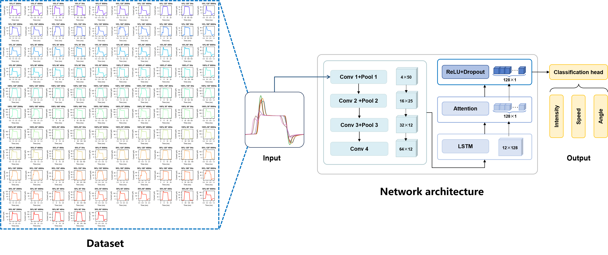

# Waveform-Encoded Strategy for Motion Perception in Multidimensional Perovskite Photodetectors

## Requirements

PyTorch ≥ 1.8

NumPy ≥ 1.20

Pandas ≥ 1.3

Matplotlib ≥ 3.4

PyWavelets (pywt) ≥ 1.1
